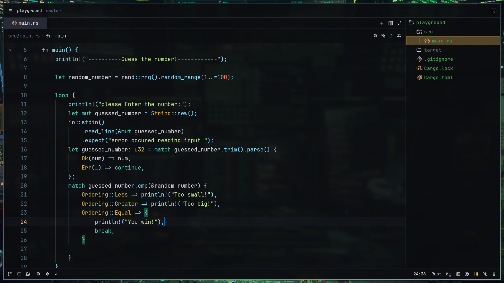
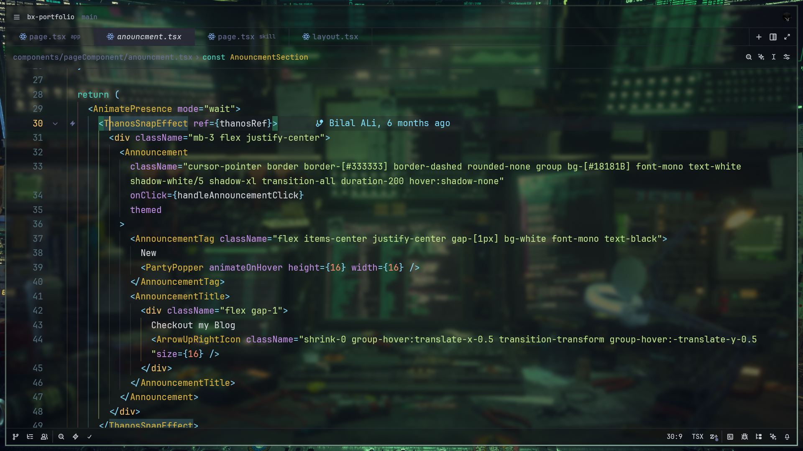

# Sercali Theme for Zed

**Sercali** is a sophisticated, "Gilded Void" aesthetic theme for the Zed IDE. It abandons the traditional "Blue/Purple" cyberpunk tropes for a unique, deep neutral palette accented by Gold, Teal, and Malachite.

## The Aesthetic: Gilded Void

Sercali is built on a **Deep Basalt** foundation—a true neutral void black with no blue tint— accented by a triad of precious minerals and vibrant energy.

*Screenshot: Sercali theme applied to Zed (dark soft blur variant).*

*Screenshot: Sercali theme applied to Zed (dark high blur variant).*

### Color Palette (Dark)

| Element | Color | Description |
| :--- | :--- | :--- |
| **Background** | `Deep Basalt` (`#0b0c0f`) | A deep, void-like neutral black. |
| **Tags** | `Vesper Gold` (`#ffcb6b`) | The hero color. Distinct and warm. |
| **Keywords** | `Vibrant Teal` (`#4bd6c3`) | Fresh, energetic, and unique combinator with Gold. |
| **Strings** | `Malachite` (`#c3e88d`) | A sharp, natural green for clear string separation. |
| **Attributes** | `Lavender` (`#c792ea`) | Clearly distinguishable from strings and keywords. |
| **Functions** | `Azure` (`#82e2ff`) | Electric blue for function calls. |

### Light Mode: Desert Noon
A warm, paper-like light theme that retains the "Ancient Tech" feel with clay, gold, and cactus green accents.

## Variants

1.  **Sercali Dark (High Blur)**
    *   Transparent background for users who love the blurred window effect.
    *   *Note: Popups and floating surfaces remain opaque for readability.*

2.  **Sercali Dark (Soft Blur)**
    *   A subtle, 90% opacity blur for a refined depth effect.

3.  **Sercali Dark (Opaque)**
    *   Solid Deep Basalt background for maximum focus and contrast.

4.  **Sercali Light (Opaque)**
    *   Solid Warm White background. Refined for daylight coding.

